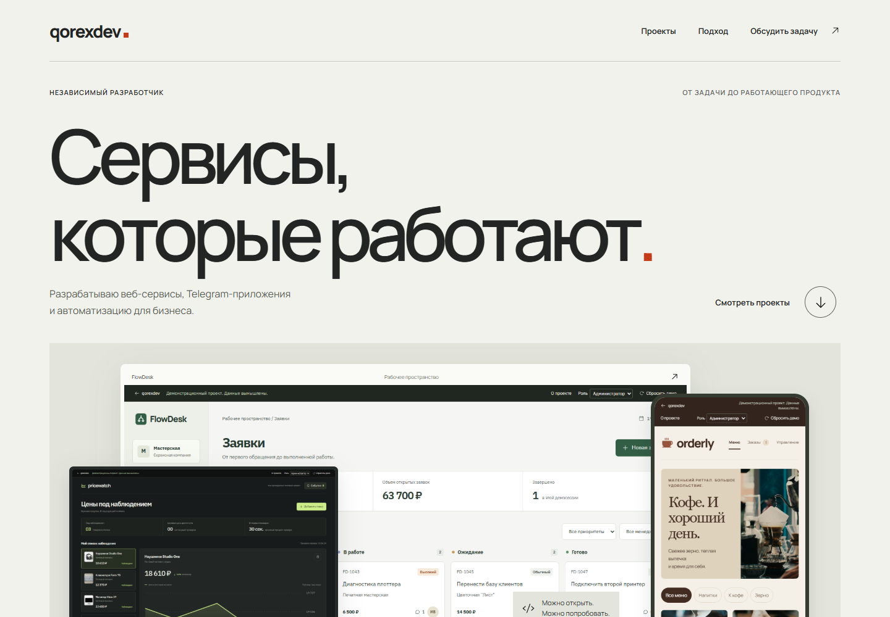

# qorexdev

Портфолио разработчика и три демоприложения: CRM, каталог с заказами и мониторинг цен.

[Telegram](https://t.me/qorexdev) / [Kwork](https://kwork.ru/user/qorexdev) / [FL.ru](https://www.fl.ru/users/qorexdevmail)



Публичный сервер пока не подключен. Для просмотра запустите проект локально по инструкции ниже. Компании, контакты и операции внутри демо вымышлены; реальные платежи и внешние сообщения не отправляются.

## Приложения

- Портфолио: главная страница, работы, задачи, процесс, контакты и три страницы кейсов.
- FlowDesk: клиенты, заявки, kanban, поиск и фильтры, исполнители, комментарии, редактирование, демонстрационные роли администратора и менеджера.
- Orderly: каталог кофейни, корзина, тестовый заказ, история, добавление и редактирование товаров, доступность и последовательные статусы приготовления. Доступен в обычном браузере.
- PriceWatch: шесть товаров контролируемого тестового каталога, фоновая проверка примерно каждые 30 секунд, история, график, пороги и уведомления внутри приложения.

Стек: React, TypeScript, Vite, Express 5, Node.js 24 и SQLite. Один Node-процесс обслуживает интерфейс, API и фоновые проверки. Caddy отвечает за HTTPS. Для небольших демо эта схема позволяет обойтись одним VPS и обычным томом с базой.

| Приложение | Интерфейс | Кейс |
| --- | --- | --- |
| FlowDesk | `/demo/flowdesk` | `/work/flowdesk` |
| Orderly | `/demo/orderly` | `/work/orderly` |
| PriceWatch | `/demo/pricewatch` | `/work/pricewatch` |

## Локальный запуск

Нужен Node.js 24 и npm. Все зависимости зафиксированы в package-lock.json.

```sh
npm ci
npm run build
npm start
```

Открыть http://localhost:3000. По умолчанию секреты и .env не нужны; SQLite создается в data/demo.sqlite. Папка data локальная, не включается в образ и архив исходников. Не используйте эту БД для реальных клиентских данных.

Для разработки запустить два терминала:

```sh
npm run dev:server
```

```sh
npm run dev
```

Интерфейс: http://localhost:5173. Vite проксирует /api с сохранением Host, поэтому отдельная CORS-конфигурация не требуется. При локальном запуске PUBLIC_ORIGIN можно оставить пустым. Если переменная задана, она должна точно совпадать с адресом страницы, включая порт, без завершающего слеша. Производственный .env из примера рассчитан на HTTPS-домен; не копируйте его без изменений для разработки.

## Проверки

GitHub Actions запускает проверку форматирования, API-тесты, production-сборку и браузерные сценарии в Chromium. Тестовая база создается отдельно от данных запущенного приложения.

```sh
npm test
npm run build
npm run test:e2e
docker compose --env-file .env.example config --quiet
```

API-тесты запускают настоящий HTTP-сервер и временную SQLite. Они проверяют изоляцию посетителей, сохранение данных, перезапуск фоновой обработки, права ролей, частичные обновления без потери полей, корзину и серверный расчет цен, повторный checkout, переходы статусов, автономную запись истории без запросов браузера, ограничения, TTL, сброс, CSRF и подпись Telegram.

Команда test:e2e сначала собирает приложение. Браузерные тесты по умолчанию используют установленный Chrome и собственный сервер на 3101 с изолированной временной SQLite, которая удаляется после завершения. Они не меняют локальную data/demo.sqlite. Для повторяемых тестов лимиты сессий на этом сервере повышены; публичные лимиты не меняются. Чтобы использовать Chromium от Playwright:

```sh
npx playwright install chromium
```

В PowerShell:

```powershell
$env:PLAYWRIGHT_CHANNEL = "chromium"
npm run test:e2e
```

В Linux/macOS:

```sh
PLAYWRIGHT_CHANNEL=chromium npm run test:e2e
```

E2E_URL позволяет проверить уже запущенный адрес. При этой настройке тесты изменяют его демоданные, поэтому используйте отдельную демосессию. Тесты не должны запускаться на настоящих клиентских данных. Скриншоты и trace не включаются в Docker-образ.

## VPS и домен

Расчетная конфигурация: один Linux VPS с 2 vCPU, 4 GB RAM, Docker Engine и Compose v2. Нагрузочное испытание на таком VPS не проводилось. Compose ограничивает приложение 1.5 CPU / 1536 MB и Caddy 0.5 CPU / 256 MB, оставляя память ОС. Сборку можно выполнить заранее на отдельном компьютере.

1. Скопировать исходники на VPS, например в /opt/qorexdev. Не переносить node_modules, data, .env с другой машины, журналы и локальные агентские файлы.
2. Создать A-запись выбранного домена на IPv4 VPS. AAAA-запись добавлять только при настроенном IPv6. Открыть входящие TCP 80/443; UDP 443 нужен для HTTP/3.
3. Скопировать .env.example в .env. Задать DOMAIN, PUBLIC_ORIGIN и ACME_EMAIL. Например DOMAIN=portfolio.example.com и PUBLIC_ORIGIN=https://portfolio.example.com. PUBLIC_ORIGIN содержит только origin, без пути и слеша в конце.
4. Ограничить чтение файла: chmod 600 .env. Секреты вводить только на сервере.
5. Проверить конфигурацию и собрать приложение:

```sh
docker compose config --quiet
docker compose up -d --build
docker compose ps
docker compose logs --tail=50 app caddy
```

Caddy автоматически получает TLS-сертификат, когда DNS указывает на VPS и порты доступны. Приложение слушает 3000 только внутри сети Compose; публично открыты 80/443 Caddy. Путь /health проверяет доступность БД и показывает время последнего прохода фонового процесса.

Данные сохраняются в named volume demo_data, сертификаты в caddy_data. Обычный docker compose down сохраняет тома. Не используйте down -v, если нужно сохранить данные или сертификаты. При обновлении замените исходники и выполните docker compose up -d --build. Храните резервную копию до изменения схемы; копировать SQLite нужно согласованно с WAL, например при остановленном приложении. Остановка прерывает демодоступ.

TRUST_PROXY=1 включен только внутри Compose с единственным доверенным прокси Caddy. При собственном запуске не включайте его, если порт Node доступен напрямую из интернета: иначе клиент сможет подменить адрес для ограничения запросов.

## Ограничения публичных демо

Cookie qorex_demo содержит случайный 256-битный токен с HttpOnly и SameSite=Lax; при HTTPS включается Secure. В БД хранится хеш токена. Каждый браузер получает отдельное пространство для всех трех демо. Роли свободно переключаются для демонстрации, действуют в этом пространстве и проверяются сервером. Это не система настоящих учетных записей. Менеджер видит все заявки своего демопространства; только администратор удаляет заявки, меняет товары и статусы заказов.

Срок пространства абсолютный: 24 часа с создания. Кнопка сброса восстанавливает все три демо в текущем браузере и не продлевает TTL. После истечения создается новая синтетическая сессия. Нельзя вводить реальные персональные данные, коммерческие секреты или настоящие платежные реквизиты.

Ограничения по умолчанию:

- 200 активных пространств всего; 20 новых пространств в час с одного IP.
- 120 API-запросов в минуту с одного IP; счетчики IP хранятся в памяти процесса.
- До 256 KiB JSON на пространство, из них до 128 KiB на данные без истории цен. Максимум 100 клиентов, 150 заявок, 40 комментариев на заявку, 40 товаров и 100 заказов; лимит размера может сработать раньше.
- До 6 отслеживаемых товаров, 120 точек на товар и 100 уведомлений.
- JSON-запрос до 32 KiB; повторная ручная проверка цены через 10 секунд.

Все операции используют серверную валидацию и транзакции SQLite. API не принимает URL товаров и не запрашивает произвольные сайты. Для изменения состояния обязательны JSON, X-Demo-Request: 1 и проверка Origin/Sec-Fetch-Site. Пороговые уведомления остаются внутри демопространства; бот не отправляет сообщения владельцу сайта или посетителю.

Фоновый процесс выбирает только пространства с наступившим сроком проверки через индекс next_check_at, не более 50 за проход. Время следующей проверки сохраняется в БД. При перезапуске выполняются просроченные проверки; пропущенные за время простоя точки не выдумываются. Начальная история явно помечена source=seed, новые точки source=background или manual. Цены синтетического каталога меняются по расписанию независимо от открытого браузера.

## Telegram и внешние подключения

Без ключей Orderly работает в браузерном деморежиме. Для проверки подписи Telegram:

1. Создать собственного бота через BotFather и настроить Mini App URL на https://ВАШ-ДОМЕН/demo/orderly.
2. На сервере задать TELEGRAM_BOT_TOKEN в .env и пересоздать app через Compose.
3. Открыть Mini App из этого бота. Фронтенд передает initData на /api/session/telegram.
4. Сервер проверяет HMAC-SHA-256, возраст auth_date до 5 минут, отсутствие дублирующихся параметров и корректный идентификатор пользователя.

Токен никогда не включается во frontend bundle. Не задавайте секреты в VITE_* переменных. Подпись меняет режим сессии на telegram, но оформление остается тестовым, роли остаются демонстрационными, реальные платежи и сообщения отключены. Настоящий бот и устройство Telegram в этой поставке не подключались. Встроенный Telegram Web с iframe может ограничивать сторонние cookies; этот режим отдельно не подтвержден. Открытие в обычном браузере остается доступным.

PriceWatch сейчас использует только контролируемый тестовый источник в server/seed.mjs (catalogAt/priceAt), вызываемый server/store.mjs. Это работающий планировщик проверок тестовых цен, а не парсер магазинов. Для реального источника нужно выбрать провайдера и реализовать серверный адаптер с его контрактом, ключом в серверной переменной окружения, allowlist адресов, таймаутами, лимитом ответа и явным состоянием ошибки источника. Универсального подключения к произвольному магазину одной переменной не заявляется; неиспользуемых ключей в примере нет. Для реальных заказов дополнительно нужны оплата, доставка, учетные записи и аудит действий. Нынешние демо не следует использовать как боевую CRM или магазин без этой работы.

## Изображения

Превью кейсов снимаются с реально работающих интерфейсов. Иллюстративные фотографии синтетических товаров хранятся локально в public/images; список источников Unsplash находится в public/images/credits.json. Они не обозначают коммерческие отношения с изображенными брендами. Шрифты подключены локально через пакеты Fontsource.

## Документация стека

- Node SQLite: https://nodejs.org/docs/latest-v24.x/api/sqlite.html
- Telegram Mini Apps: https://core.telegram.org/bots/webapps
- Docker Compose services: https://docs.docker.com/reference/compose-file/services/
- Caddy: https://caddyserver.com/docs/caddyfile/concepts
